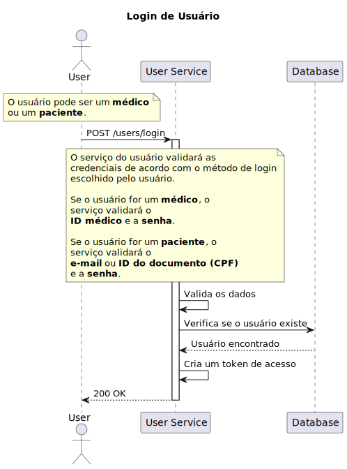
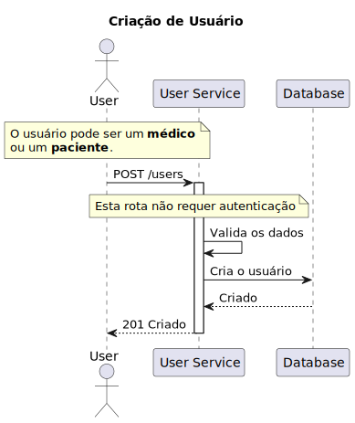
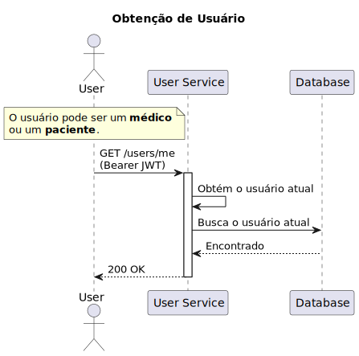
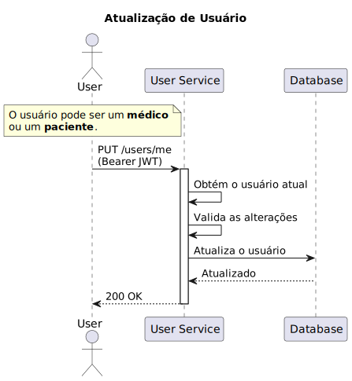
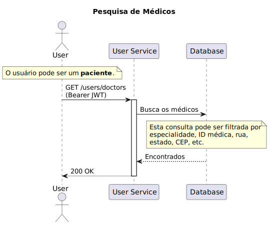
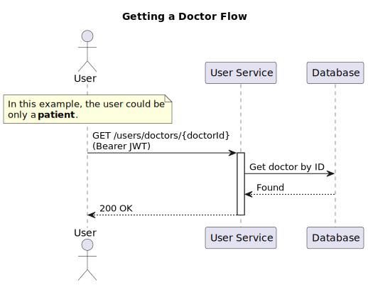

# User Service

Service responsible to manage the users

# Local Development

## Requirements

- [Kubernetes](https://kubernetes.io/)
- [AWS CLI](https://aws.amazon.com/cli/)

## Manual deployment

### Attention

Before deploying the service, make sure to set the `AWS_ACCESS_KEY_ID` and `AWS_SECRET_ACCESS_KEY` environment variables.

Be aware that this process will take a few minutes (~4 minutes) to be completed.

To deploy the service manually, run the following commands in order:

```bash
make init
make check # this will execute fmt, validate and plan
make apply
```

To destroy the service, run the following command:

```bash
make destroy
```

## Automated deployment

The automated deployment is triggered by a GitHub Action.

# Endpoints

Legend:
- ✅: Development completed
- 🚧: In progress
- 💤: Not started


| Completed | Method | Endpoint                            | Description                                            | User Role      |
| --------- | ------ | ----------------------------------- | ------------------------------------------------------ | -------------- |
| ✅         | POST   | `/users/login`                      | Login a user                                           | Doctor/Patient |
| ✅         | POST   | `/users`                            | Create a user                                          | Doctor/Patient |
| ✅         | GET    | `/users/me`                         | Get the current user                                   | Doctor/Patient |
| ✅         | PUT    | `/users/me`                         | Update a user                                          | Doctor/Patient |
| ✅         | GET    | `/users/doctors`                    | Get doctors by Medical ID, specialty, city, state, etc | Patient        |
| ✅         | GET    | `/users/doctors/{doctorId}`         | Get doctor by ID                                       | Patient        |
| ✅         | POST   | `/users/doctors/{doctorId}/ratings` | Rate a doctor                                          | Patient        |


# Diagrams

## Login Flow

In this diagram we can see the simplified flow of the user login.



## Creating a User Flow

In this diagram we can see the simplified flow of the user creation.



## Getting a User Flow

In this diagram we can see the simplified flow of the user getting.



## Updating a User Flow

In this diagram we can see the simplified flow of the user updating.



## Searching Doctors Flow

In this diagram we can see the simplified flow of the user searching doctors.



## Getting a Doctor Flow

In this diagram we can see the simplified flow of the user getting a doctor.



# License

This project is licensed under the MIT License - see the [LICENSE](LICENSE) file for details.