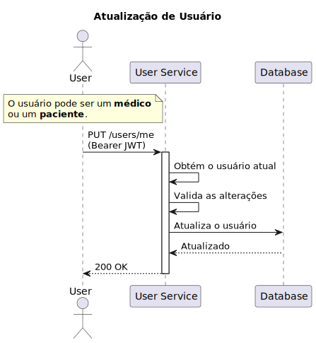
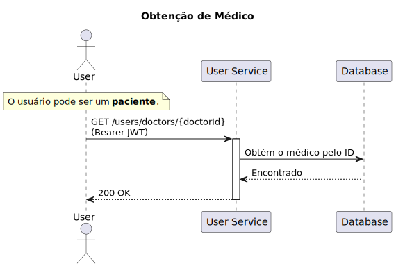

# User Service

Este serviço é responsável pelo gerenciamento de usuários, ele criará, atualizará, obterá e excluirá usuários (pacientes e médicos).

Além disso, permite que os pacientes pesquisem médicos por especialidade, cidade, estado, etc.

# Desenvolvimento Local

## Requisitos

- [Terraform](https://www.terraform.io/downloads.html)
- [Terraform Docs](https://github.com/terraform-docs/terraform-docs)
- [AWS CLI](https://aws.amazon.com/cli/)

## Implantação manual

### Atenção

Antes de implantar o cluster, certifique-se de definir as variáveis ​​de ambiente `AWS_ACCESS_KEY_ID` e `AWS_SECRET_ACCESS_KEY`.

Esteja ciente de que esse processo levará alguns minutos (~4 minutos) para ser concluído.

Para implantar o cluster manualmente, execute os seguintes comandos em ordem:

```bash
make init
make check # this will execute fmt, validate and plan
make apply
```

Para destruir o cluster, execute o seguinte comando:

```bash
make destroy
```

## Implantação Automatizada

A implantação automatizada é acionada por uma GitHub Action.

# Rotas

| Método | Rota                                | Descrição                                                | Papel do Usuário |
| ------ | ----------------------------------- | -------------------------------------------------------- | ---------------- |
| POST   | `/users/login`                      | Login de um usuário                                      | Médico/Paciente  |
| POST   | `/users`                            | Cria um usuário                                          | Médico/Paciente  |
| GET    | `/users/me`                         | Obtém o usuário atual                                    | Médico/Paciente  |
| PUT    | `/users/me`                         | Atualiza um usuário                                      | Médico/Paciente  |
| GET    | `/users/doctors`                    | Obtém médicos por ID, especialidade, cidade, estado, etc | Paciente         |
| GET    | `/users/doctors/{doctorId}`         | Obtém o médico por ID                                    | Paciente         |
| POST   | `/users/doctors/{doctorId}/ratings` | Avalia um médico                                         | Paciente         |

# Diagramas

## Fluxo de Login

No diagrama abaixo podemos ver o fluxo simplificado de login.


## Fluxo de Criação de Usuário

No diagrama abaixo podemos ver o fluxo simplificado de criação de usuário.


## Fluxo de Obtenção de Usuário

No diagrama abaixo podemos ver o fluxo simplificado de obtenção de usuário.


## Fluxo de Atualização de Usuário

No diagrama abaixo podemos ver o fluxo simplificado de atualização de usuário.



## Fluxo de Pesquisa de Médicos

No diagrama abaixo podemos ver o fluxo simplificado de pesquisa de médicos.


## Fluxo de Obtenção de Médico

No diagrama abaixo podemos ver o fluxo simplificado de obtenção de médico.



# Licença

Este projeto é licenciado sob a Licença MIT - veja o arquivo [LICENSE](LICENSE) para detalhes.